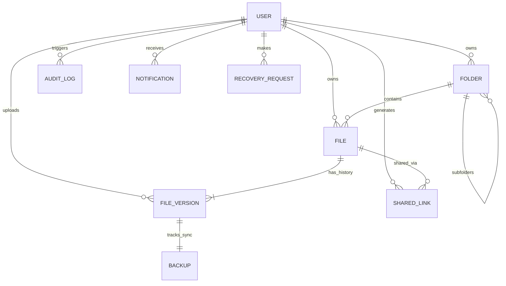

# Disaster Recovery Vault (DR Vault)

Disaster Recovery Vault is a secure, cloud-based document backup and disaster recovery platform designed for small and medium businesses. 

It acts as a business-continuity-focused file storage system (similar to Google Drive focused on resilience), where every document uploaded is automatically backed up, versioned, encrypted, and instantly recoverable after accidental deletion, hardware failure, or ransomware attacks.

---

## 🚀 Key Features

* **Dual S3 Backup Pipeline**: Every file version uploaded is replicated to an AWS S3 Backup Bucket using the standard storage class (fully Free Tier eligible).
* **Automatic Document Versioning**: Multiple uploads with the same name are versioned (`v1`, `v2`, `v3`). Previous versions can be downloaded or promoted to active.
* **Safe-Delete Recycle Bin**: Deleting a file moves it to the trash. Safe one-click restorations and permanent purges are managed from the Disaster Recovery panel.
* **Secure Expirable Sharing**: Share files with random tokens, optional passcode encryption (bcrypt), expiration dates, and tracking telemetry.
* **Full Audit Trail Logging**: Administrative audit logs track actions (Logins, Uploads, Downloads, Sharing, and Restorations) with IP addresses and user agents.
* **SaaS Telemetry Dashboard**: Rich Glassmorphic analytics featuring charts (using Recharts) for storage usage, backup metrics, recent logs, and AWS connection statuses.
* **AWS Free Tier Focused**: Restricted to standard free tier usage (5GB S3 space, standard CloudWatch metrics, email-based SNS publish).
* **AWS Emulator Fallback**: Falls back to emulated local storage automatically if AWS configuration variables are missing.

---

## 🛠️ Technology Stack

* **Frontend**: React.js, TypeScript, Tailwind CSS (Glassmorphism layout), Framer Motion (micro-animations), Recharts, React Router.
* **Backend**: Node.js, Express.js, TypeScript, Multer, Helmet, Express Rate Limiter.
* **Database**: PostgreSQL (Relational schema modeled using Prisma ORM).
* **Authentication**: JWT access tokens + persistent Refresh tokens + bcrypt password hashing.
* **Cloud**: AWS S3, AWS SNS, AWS CloudWatch.

---

## 📂 System Folder Structure

```
├── backend/
│   ├── prisma/
│   │   ├── schema.prisma      # Prisma PostgreSQL relational schema
│   │   └── seed.ts            # Local mock seed data script (files, folder structure, audits)
│   ├── src/
│   │   ├── config/            # Server environment variables config
│   │   ├── controllers/       # Controllers (auth, files, backups, shares, admin)
│   │   ├── middlewares/       # Express JWT auth, role validation, error capturing, rate limiters
│   │   ├── routes/            # REST API endpoint route routing
│   │   └── services/          # S3 storage, SNS notifications, CloudWatch monitoring services
│   ├── Dockerfile
│   └── tsconfig.json
├── frontend/
│   ├── src/
│   │   ├── components/
│   │   │   └── common/        # Glassmorphic Layouts, Modals, Pulse Skeletons, Sliding Toasts
│   │   ├── context/           # React Authentication state contexts
│   │   ├── pages/             # Dashboard, File Vault, Recovery Station, Public share, Admin
│   │   ├── services/          # Axios API interceptors
│   │   └── main.tsx           # Providers, route guards and entry portal
│   ├── Dockerfile
│   ├── tailwind.config.js
│   └── vite.config.ts
└── docker-compose.yml         # Dev cluster bootstrapping
```

---

## 🗄️ Database ER Diagram (Prisma Models)



---

## ⚙️ Environment Variables

Copy these variables into a `.env` file at the root or inject them into your Docker orchestration:

```env
# Database Credentials
DATABASE_URL="postgresql://dr_vault_user:dr_vault_secure_password@db:5432/dr_vault_db?schema=public"

# Session Security Keys
JWT_SECRET="dr_vault_jwt_secret_key_change_in_production"
JWT_REFRESH_SECRET="dr_vault_jwt_refresh_secret_key_change_in_production"

# AWS Configuration (Omit to trigger Local Fallback Emulation automatically)
AWS_ACCESS_KEY_ID="your_aws_access_key"
AWS_SECRET_ACCESS_KEY="your_aws_secret_key"
AWS_REGION="us-east-1"
AWS_S3_BUCKET="your-s3-vault-bucket"
AWS_SNS_TOPIC_ARN="arn:aws:sns:us-east-1:123456789012:your-sns-topic"
MOCK_AWS="false"
```

---

## ⚡ Setup & Local Deployment

To start the database, backend, and frontend inside a unified Docker container environment:

### 1. Build and Start Services
```bash
docker-compose up --build
```
* **Frontend Portal**: `http://localhost:3000`
* **Backend API**: `http://localhost:5000`

### 2. Run Database Migrations and Seeding
In a separate terminal, execute Prisma migrations and populate the database with mock folders and version metrics:
```bash
# Enter backend container context
docker-compose exec backend npx prisma migrate dev --name init
# Seed data
docker-compose exec backend npm run prisma:seed
```

### 3. Out-of-the-Box Demo Credentials
* **Administrator Profile**: `admin@drvault.com` / Password: `admin_password_123`
* **Employee Profile**: `employee@drvault.com` / Password: `employee_password_123`

---

## 🛡️ AWS Free Tier Integration Guide

To deploy this in production under the AWS Free Tier, configure these AWS resources:

### 1. S3 Backup Vault (Free Tier: 5GB Standard Space)
1. Navigate to the **S3 Console** and create a bucket (e.g. `dr-vault-backups`).
2. Keep **Block all public access** enabled. All files are private and streamed securely via pre-authenticated AWS SDK calls.
3. Enable **Bucket Versioning** to match S3 object version keys.
4. (Optional) Create a **Lifecycle Rule** to transition trash versions to Glacier after 30 days.

### 2. CloudWatch (Free Tier: 5GB Log Ingestion, 10 Metrics)
1. Metrics like `BackupSuccess` and `UploadTime` are dispatched automatically under the custom Namespace `DRVault`.
2. Standard logging groups are generated in the default namespace without requiring paid configurations.

### 3. SNS Alerts (Free Tier: 1 Million Notifications)
1. Open the **SNS Console** and create a **Standard Topic** named `DRVaultAlerts`.
2. Under **Subscriptions**, add your email address using the `Email` protocol.
3. Confirm subscription in your email inbox to receive real-time warnings (such as Suspicious Logins, Backup complete).
